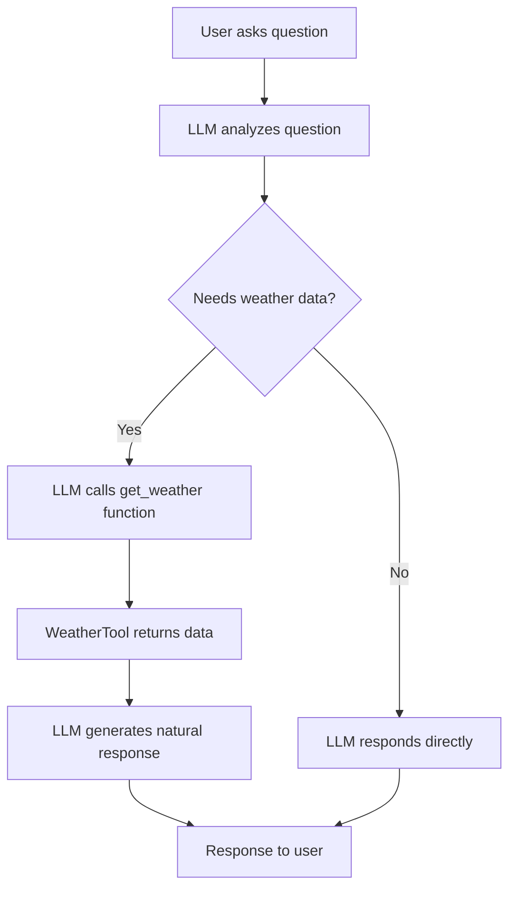

# Simple Weather Agent 🌤️

A simple agentic application built with Google's Gemini LLM that demonstrates function calling patterns. The agent uses hardcoded weather data to respond to natural language weather queries.

## Features

- 🧠 **LLM Function Calling**: Uses Google Gemini to decide when to call weather tools
- 🛠️ **Simple Tool Integration**: Hardcoded weather data for demo purposes
- 🎭 **Mock Mode**: Works without API key for learning/testing
- 🏗️ **Clean Architecture**: Each class in its own file
- ⚡ **Fast Setup**: Uses UV package manager

## Quick Start

### Prerequisites
- Python 3.8+
- UV package manager ([install here](https://docs.astral.sh/uv/getting-started/installation/))
- Google AI API key (optional - see setup below)

### Getting Your Google AI API Key

**⚠️ Note**: The API key is optional - the app works in mock mode without it for learning purposes.

1. **Visit Google AI Studio**: Go to [https://aistudio.google.com/app/apikey](https://aistudio.google.com/app/apikey)

2. **Sign in**: Use your Google account to sign in

3. **Create API Key**: 
   - Click "Create API Key"
   - Choose "Create API key in new project" (or select existing project)
   - Copy the generated API key

4. **Keep it secure**: 
   - ⚠️ Never share your API key publicly
   - ⚠️ Don't commit it to version control
   - Store it in your `.env` file (see installation steps below)

5. **Free tier info**: 
   - Google AI Studio provides free tier access
   - Sufficient for testing and learning
   - No credit card required for basic usage

### Installation

```bash
# Clone the repository
git clone https://github.com/yourusername/simple-weather-agent.git
cd simple-weather-agent

# Install dependencies with UV
uv sync

# Optional: Add your Google AI API key
cp .env.example .env
# Edit .env file and add: GOOGLE_API_KEY=your-actual-api-key-here

# OR create .env file directly:
echo "GOOGLE_API_KEY=your-api-key-here" > .env
```

### Usage

```bash
# Run the agent
uv run python main.py
```

## Example Interactions

```
You: What's the weather in London?
🤖 Agent: The weather in London is currently rainy with a temperature of 8°C.

You: How hot is it in Tokyo?
🤖 Agent: The current temperature in Tokyo is 22°C.

You: Is it humid in New York?
🤖 Agent: The humidity in New York is 45%.
```

## Architecture

```
simple-weather-agent/
├── config.py          # Configuration and environment management
├── weather_tool.py     # Weather data tool with function schema
├── weather_agent.py    # LLM integration and function calling
├── main.py            # Application interface and chat loop
└── pyproject.toml     # Dependencies and project config
```

### Components

- **`Config`**: Manages environment variables and API key validation
- **`WeatherTool`**: Provides hardcoded weather data with LLM function schema
- **`WeatherAgent`**: Handles LLM interactions and function calling logic
- **`WeatherApp`**: Manages user interface and application flow

## Mock Mode

If no Google AI API key is provided, the app runs in mock mode showing exactly what the LLM interactions would look like:

```
🔧 [Mock] LLM is calling: get_weather(location='London')
🔧 [Mock] Tool returned: {"location": "London", "temperature": 8...}
🤖 [Mock] LLM generated response: The weather in London is rainy...
```

This is perfect for:
- 📚 Learning how function calling works
- 🧪 Testing the application logic
- 🎓 Educational demonstrations

## Available Locations

The tool has hardcoded data for:
- **San Francisco** (18°C, Partly cloudy)
- **New York** (12°C, Sunny)
- **London** (8°C, Rainy)
- **Tokyo** (22°C, Clear)
- **Paris** (15°C, Cloudy)

Unknown locations return pleasant default weather (20°C, Pleasant).

## Function Calling Flow



## Development

### Adding New Cities

Edit `weather_tool.py` and add to the `weather_data` dictionary:

```python
"your_city": {
    "temperature": 25,
    "description": "Sunny",
    "humidity": 50
}
```

### Testing Different Question Formats

```bash
# Temperature questions
"What's the temperature in Paris?"
"How hot is it in Tokyo?"

# General weather questions  
"What's the weather like in London?"
"How's the weather in New York?"

# Specific conditions
"Is it humid in Miami?"
"Is it raining in London?"
```

### Environment Setup

#### Option 1: With Google AI API Key (Recommended)

1. **Get your API key** (see "Getting Your Google AI API Key" section above)

2. **Create environment file**:
   ```bash
   # Copy example file
   cp .env.example .env
   
   # Add your actual API key
   echo "GOOGLE_API_KEY=your_actual_api_key_here" > .env
   ```

3. **Run with real LLM**:
   ```bash
   uv run python main.py
   ```

#### Option 2: Mock Mode (No API Key)

Perfect for learning and testing:

```bash
# Just run without any .env file
uv run python main.py
```

The app will automatically detect no API key and run in educational mock mode.

## Technology Stack

- **Language**: Python 3.8+
- **LLM**: Google Gemini 1.5 Flash
- **Package Manager**: UV
- **Libraries**: 
  - `google-generativeai` - Gemini API client
  - `python-dotenv` - Environment variable management

## Project Structure Benefits

This project demonstrates:
- ✅ **Clean separation of concerns** (each class has one responsibility)
- ✅ **Easy testing** (mock mode without external dependencies)
- ✅ **Simple deployment** (minimal configuration required)
- ✅ **Educational value** (clear demonstration of agentic patterns)

## Contributing

1. Fork the repository
2. Create a feature branch (`git checkout -b feature/amazing-feature`)
3. Commit your changes (`git commit -m 'Add amazing feature'`)
4. Push to the branch (`git push origin feature/amazing-feature`)
5. Open a Pull Request

## License

This project is licensed under the MIT License - see the [LICENSE](LICENSE) file for details.

## Acknowledgments

- Built with [Google Gemini AI](https://ai.google.dev/)
- Package management by [UV](https://docs.astral.sh/uv/)
- Demonstrates agentic patterns from Google Agent Development Kit concepts

## Future Enhancements

Potential improvements for learning:
- 🌐 Real weather API integration
- 🗺️ Better location parsing with NLP
- 📊 Weather history and forecasting
- 🔧 Additional tools (news, calendar, etc.)
- 🎨 Web interface with Streamlit/FastAPI

---

**⭐ If this project helped you learn about agentic applications, please give it a star!**